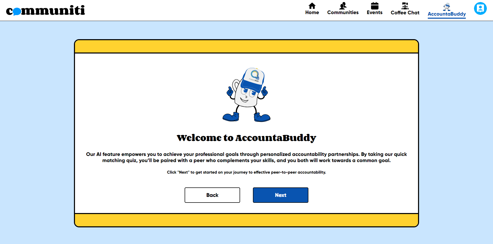
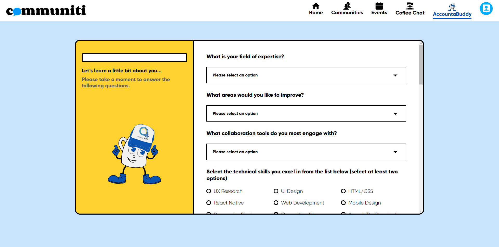
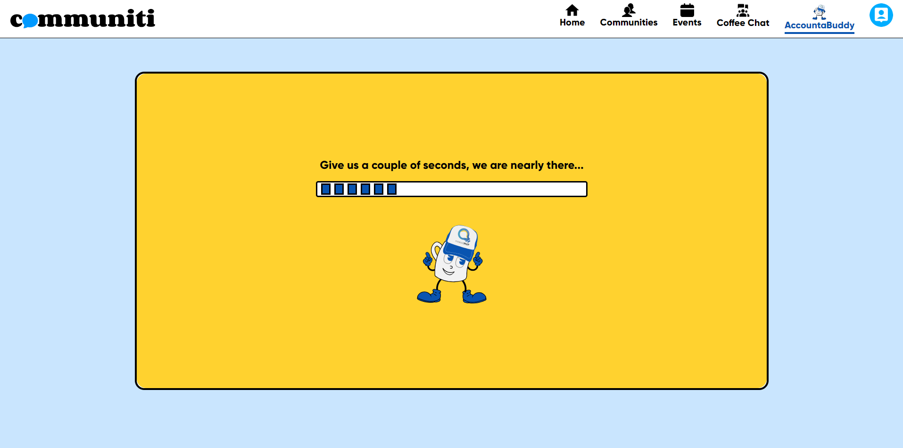
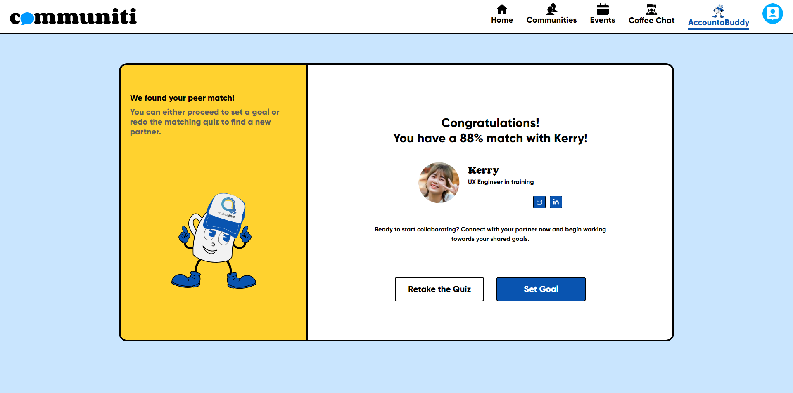
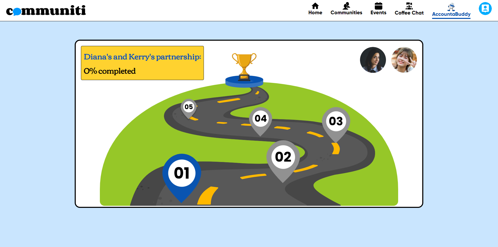
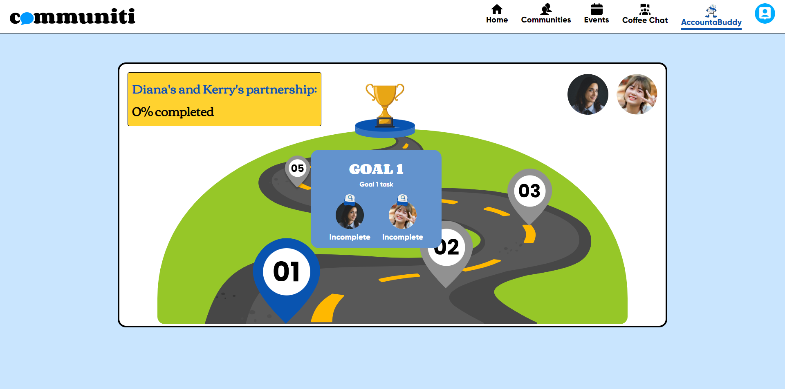
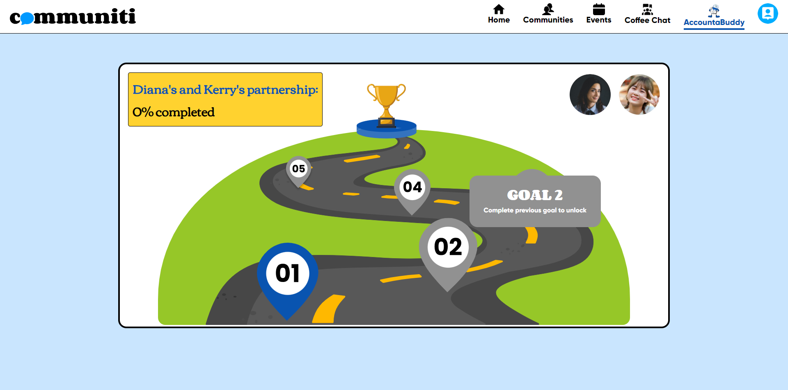
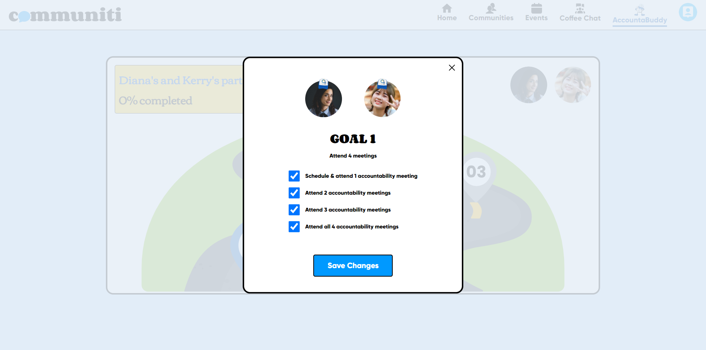
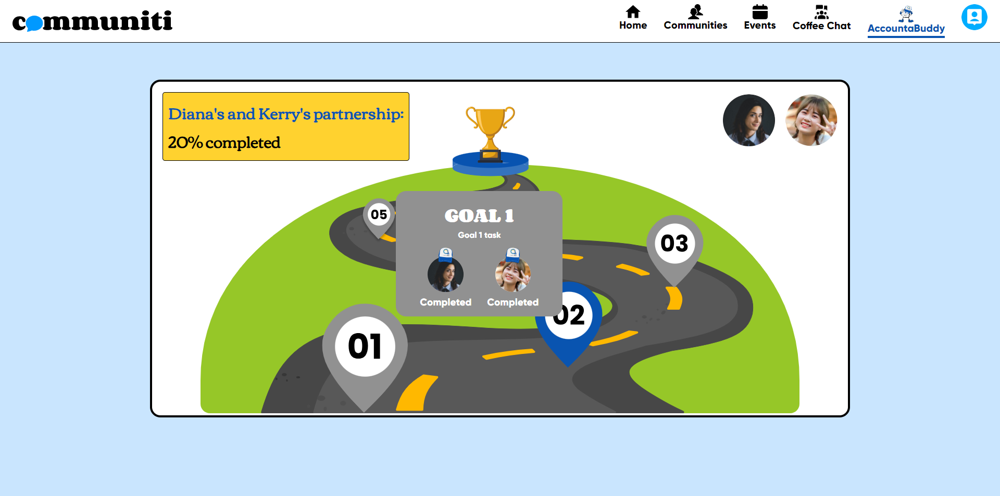
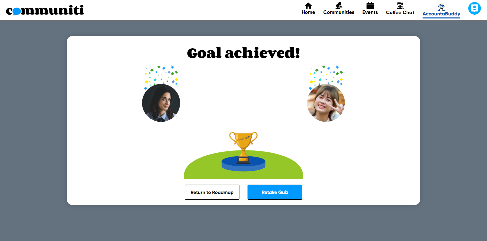

# MakeItMVP Launch Academy Phase 4: Project AccountaBuddy

## Project Description

Welcome to the MakeItMVP Launch Academy Phase 4 - Project Accountabuddy! This project is built using React and Sass, leveraging OpenAI's API to enhance its functionality.

AccountaBuddy extends the capabilities of makeitMVP's existing Communiti platform. Our mission is to empower individuals to achieve their professional goals through meaningful peer-to-peer accountability partnerships.

By using a detailed questionnaire to assess users' backgrounds and skills, we match them with partners who can help each other stay accountable. The use of AI facilitates the creation of personalized shared goals for these pairs to accomplish together.

## Table of Contents

- [Getting Started](#getting-started)
- [Project Structure](#project-structure)
- [Technologies](#technologies)
- [Contributors](#contributors)
- [Screenshots](#Screenshots)

## Getting Started

To view the project, follow these steps:

1. Clone this repository to your local machine:

   ```bash
   git clone https://github.com/makeitMVPadmin/P4_Connect_AI.git
   ```

2. Change the working directory to the cloned repository:

   ```bash
   cd P4_Connect_AI
   ```

3. Install the project dependencies:

   ```bash
   npm install
   ```

4. Create a .env file with the necessary environment variables for Firebase and OpenAI.

   ```bash
   REACT_APP_FIREBASE_API_KEY=
   REACT_APP_FIREBASE_AUTH_DOMAIN=
   REACT_APP_FIREBASE_PROJECT_ID=
   REACT_APP_FIREBASE_STORAGE_BUCKET=
   REACT_APP_FIREBASE_MESSAGING_SENDER_ID=
   REACT_APP_FIREBASE_APP_ID=
   REACT_APP_FIREBASE_MEASUREMENT_ID=
   REACT_APP_OPENAI_API_KEY=
   ```

5. Start the development server:

   ```bash
   npm start
   ```

6. Open your web browser and navigate to `http://localhost:3000` to see the project running.

## Project Structure

The project structure is organized as follows:

```
├── public/
│   ├── index.html
│   ├── ...
├── src/
│   ├── assets/
│   ├── components/
│   │   ├── QuizPage
│   │   │   ├── ...
│   │   ├── ...
│   ├── config/
│   ├── pages/
│   │   ├── PromptPage
│   │   │   ├── ...
│   ├── ...
│   ├── styles/
│   │   ├── partials
│   ├── utils/
│   │   ├── functions
├── App.js
├── data.js
├── firebase.js
├── index.js
├── main.js
├── .env
├── .gitignore
├── package-lock.json
├── package.json
├── README.md
```

- `src/`: Contains the main source code for the project, including React components and styles.
- `package.json`: Defines project dependencies and scripts.
- Our components are conditionally shown through React states and use mainly one page (PromptPage), instead of routes

## Technologies

This repository uses the following technologies:

- React: A JavaScript library for building user interfaces.
- Sass: A CSS extension language that adds features like variables, nesting, and more.
- OpenAI: An AI platform providing natural language processing capabilities, used for personalizing user interactions and goal formation in the project.

## Contributors

Our team comprises two sub-teams - "Project AccountaBuddy" and "Project Infrastructure".
Project AccountaBuddy handled the front-end designs and code, and Project Infrastructure handled the back-end code and database.

### Designers (Project AccountaBuddy)

- [Anna Ryzha](https://www.linkedin.com/in/anna-ryzha/)
- [Helena Dinh](https://www.linkedin.com/in/helena-thy-dinh/)
- [Isha Umaima](https://www.linkedin.com/in/isha-umaima/)

### Front-end Developers (Project AccountaBuddy)

- [Aparna Dhara](https://www.linkedin.com/in/aparna-dhara/)
- [Gloria Lau](https://www.linkedin.com/in/gloria-sm-lau/)
- [John Henriksen](https://www.linkedin.com/in/john-henriksen/)
- [Jagadeep Avula](https://www.linkedin.com/in/jagadeepavula/)
- [Madhuja Mitra](https://www.linkedin.com/in/madhuja-mitra-0a083377/)
- [Mohan Krishna Hasti](https://www.linkedin.com/in/mohankrishnahasti/)

### Back-end Developers (Project Infrastructure)

- [Andrea Matos](https://www.linkedin.com/in/drevm/)
- [Avi Brar](https://www.linkedin.com/in/avi-brar/)
- [Masoud Arefi](https://www.linkedin.com/in/masoud-arefi/)

### Product Manager

- [Alberto Borgonovo](https://www.linkedin.com/in/alberto-borgonovo/) (Project Infrastructure)

### Team Leads

- [Dinne Kopelevich](https://www.linkedin.com/in/dinne-kopelevich/) (Project AccountaBuddy)
- [Scott Schwab](https://www.linkedin.com/in/scott-p-schwab/) (Project Infrastructure)

## Screenshots

### Home page



### Quiz Screen



### Loading Screen



### Match Screen



### Roadmap Landing Screen



### Roadmap Hover State Active



### Roadmap Hover State Inactive



### Roadmap Goal Modal



### Roadmap Mid-progress Hover



### Roadmap Goal Achieved Screen



This project is licensed under the [MIT License](LICENSE).
